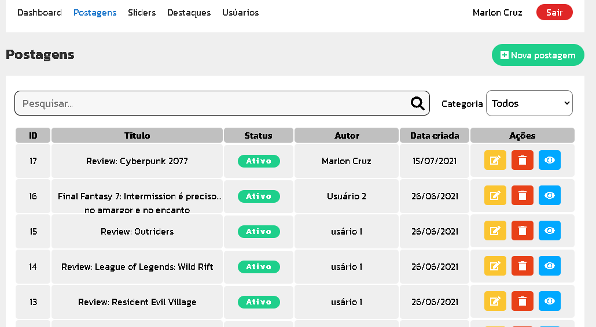
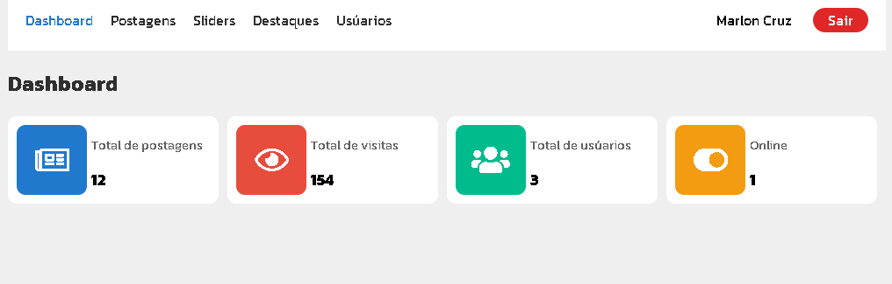
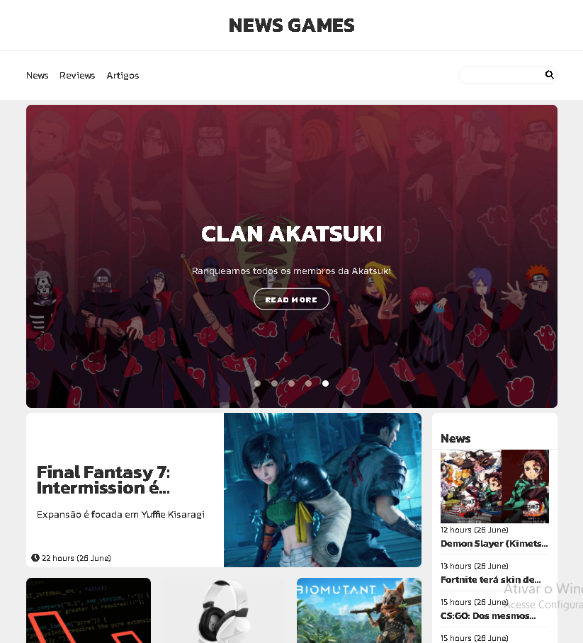
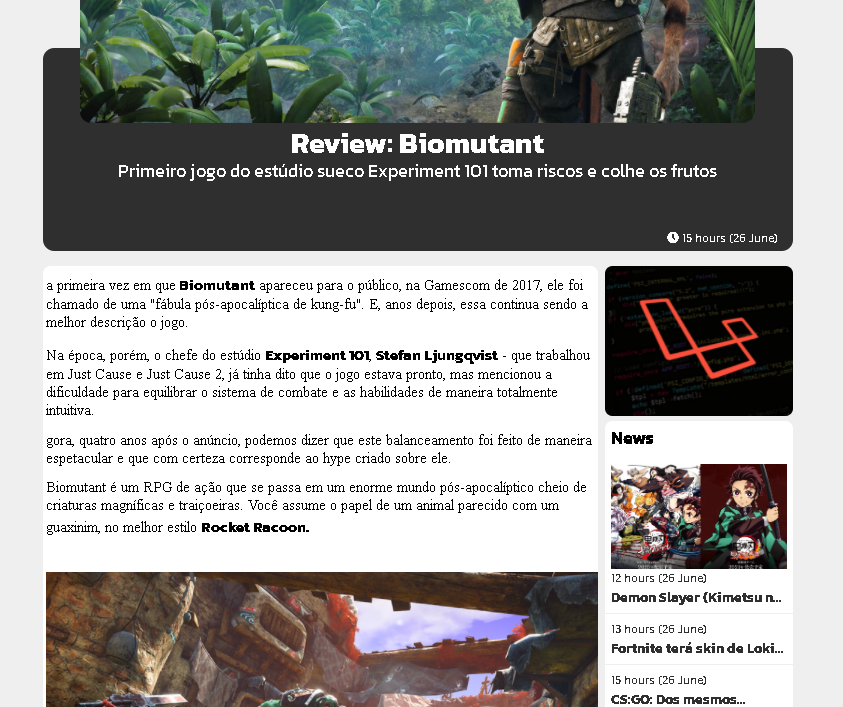

# NEWS GAMES

# Sobre o projeto
News Games é uma aplicação CMS com foco portal de notícias em conteúdo na area de jogos.

aplicação consiste duas parte de sistema que são Dashboard e Site.

## Dashboard
Administrador pode gerênciar o conteúdos das notícias (criar, editar, deletar e etc).





## Site 
Cliente pode visualizar e filtrar os conteúdos das notícias.




# Tecnologias utilizados
## Front end
- HTML / CSS / JS
## Back end
- LARAVEL

# Como executar o projeto
Pré-requisitos: Composer, Laravel

```bash
# clonar repositório
git clone https://github.com/marlinho20/newsgames.git

# instalar dependências
composer install

# executar o projeto
php artisan server
```
